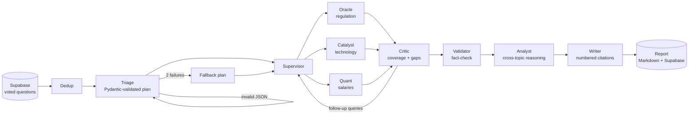

# SSI Blog Agent

[](https://github.com/bashiir-code/ssi_trustgraph/actions/workflows/ci.yml)

A multi-agent research pipeline built on **LangGraph**. It takes the questions
members of Suomen Somali Insinöörit ry vote up most, researches the Finnish
engineering job market, and publishes one **cited, fact-checked Markdown
report**. The reports themselves are written in Finnish.

Specialist agents, a critic that sends research back for another round, a
validator, and an analyst/writer pair turn raw web search and official
Statistics Finland data into a report where every claim links to a numbered
source.

## Try it without API keys

Demo mode replaces every external service (DeepSeek, Supabase, Tavily,
Firecrawl, Statistics Finland, Upstash Redis) with deterministic fakes, so the
real graph runs end to end on your machine:

```bash
python -m venv .venv && source .venv/bin/activate
pip install -e . -r requirements.txt pytest
DEMO_MODE=1 python -m ssi_blog_agent.main   # writes artifacts/report_*.md
pytest -q tests
```

CI does the same on every push. The generated report appears on each run's
summary page under [Actions](https://github.com/bashiir-code/ssi_trustgraph/actions).
All figures and sources in demo mode are synthetic.

## How it works



Each question runs through its own graph, and questions are researched in
parallel (bounded concurrency). The analyst and writer then run once over the
results for all questions.

1. **Data entry.** Fetches the top-voted questions and removes near-duplicates
   with an LLM pass, so the same topic isn't researched twice.
2. **Triage.** Splits each question into 2–4 focused sub-queries and tags each
   with a specialist. The plan is validated with Pydantic. If it's invalid, the
   error goes back to the model for a retry. After two failures it falls back
   to a plain plan instead of crashing.
3. **Research.**
   - The supervisor routes each sub-query to the **Oracle** (regulation,
     standards), **Catalyst** (technology, skills) or **Quant** (salaries,
     costs). Each specialist searches its own authoritative domains.
   - The Quant pulls **official Statistics Finland figures** and cites them
     ahead of web results.
   - The **critic** scores coverage and sends follow-up queries back to the
     supervisor. It stops at 85 % coverage or after two rounds.
   - The **validator** flags unsupported claims and rates confidence.
4. **Synthesis.** An analyst model reasons across all topics (scenarios,
   tensions, implications). A writer model then renders the report, and a
   numbered bibliography is appended to it automatically.

### Reliability features

- **Partial success.** A failing agent (for example, an HTTP 429 that outlasts
  its retries) yields a failed fact sheet, and the report still ships with
  everything else.
- **Prompt-injection guard.** Scraped content is framed as data, never as
  instructions.
- **Pointer pattern.** Raw search text goes to a Supabase scratchpad, and only
  compressed summaries stay in the graph state.
- **Cost budget.** A per-run cap halts research gracefully and publishes a
  partial report.
- **Operations.** A Redis run-lock prevents double publishing, a 7-day Redis
  cache avoids repeating searches, and Slack gets a message with each run's
  result.

## Tests

| Command | What it shows |
|---|---|
| `pytest -q tests` | Full pipeline in demo mode: dedup, triage retry, specialist routing, critic follow-up round, official data cited first, run-lock, cost accounting |
| `python scripts/test_triage_retry.py` | Malformed triage output retries, then falls back |
| `python scripts/test_partial_success.py` | A forced 429 degrades gracefully instead of crashing the run |
| `python scripts/test_presentation.py` | Report formatting guardrails and traceable `[n]` citations |

`scripts/verify_chunk3.py` and `scripts/chunk0_smoke_test.py` are live checks
that need real credentials.

## Running live

Copy `.env.example` to `.env` and fill in DeepSeek, Supabase, Tavily,
Firecrawl and, optionally, Upstash Redis and a Slack webhook. Create the tables
with the SQL scripts in `scripts/`, seed questions with
`scripts/seed_questions.py`, then:

```bash
python -m ssi_blog_agent.main
```

## Project structure

```
src/ssi_blog_agent/
  main.py                  Entrypoint: run-lock, parallel research, synthesis, alerts
  graph.py                 LangGraph wiring (triage -> supervisor <-> critic -> validator)
  demo.py                  Offline fakes for every external service (DEMO_MODE=1)
  config.py, models.py, state.py
  layer1_data_entry.py     Top-voted questions + LLM dedup
  layer2_triage.py         Triage, retry loop, fallback
  layer3_research/
    supervisor.py          Routes sub-queries to specialists
    oracle.py, catalyst.py, quant.py
    base_agent.py          Cache -> official data -> search -> full text -> grounded summary
    critic.py, validator.py
    research_tools.py      Shared search/scrape/scratchpad interface + injection guard
    statfi_source.py       Curated Statistics Finland salary tables
    redis_cache.py         7-day research cache
  layer4_presentation.py   Analyst + writer + deterministic bibliography
  clients/                 DeepSeek, Supabase, Tavily/Firecrawl, Statistics Finland
  crosscutting/            Run-lock, budget breaker, Slack notification
scripts/                   Offline proofs, live smoke tests, Supabase SQL
tests/                     End-to-end demo-mode tests
```

## Suomeksi

Agenttiputki tutkii jäsenten äänestämät kysymykset Suomen insinöörimarkkinasta
ja kirjoittaa lähteistetyn raportin. Kokeile ilman API-avaimia:
`DEMO_MODE=1 python -m ssi_blog_agent.main`.
